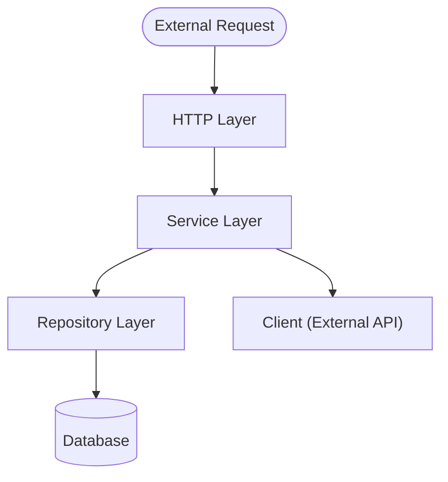

# Go REST API

## Requirements

- [Go 1.24](https://golang.org/dl/)
- [Docker](https://www.docker.com/)
- [Docker Compose](https://docs.docker.com/compose/)
- [Task](https://taskfile.dev/)

## REST API Architecture Overview



## Getting Started

You can use the `task` command to run the project. The `task` command is a task runner that allows you to define and run tasks in a simple way.

```bash
task run
task test
task lint
task build
```

## Testing

This project has three types of tests:

- Unit tests
- Integration tests
- End-to-end tests

For the integration and end-to-end tests [Testcontainers](https://www.testcontainers.org/) is used to create a test database and run the tests against it. The tests are run in a Docker container, so you need to have Docker installed and running on your machine.
